# Real Estate Market Analysis
## Strategic Insights for Business Decision-Making

---

## Executive Summary

This analysis examines **7,062 property listings** across Azerbaijan's real estate market, revealing critical insights for investment strategy, market positioning, and business development. Our findings highlight clear market patterns, pricing dynamics, and opportunities for strategic advantage.

### Key Findings at a Glance:

- **Market is Sales-Driven**: 76% of listings are sales, indicating strong ownership demand
- **Mid-Size Properties Dominate**: 70% of market consists of 2-3 room properties
- **Geographic Concentration**: Baku controls 80% of market activity
- **Price Segmentation**: Mid-range properties (100-300K AZN) represent the largest opportunity
- **Financing Gap**: Only 1 in 5 properties offer credit options, suggesting expansion potential
- **Market Stability**: Minimal price reductions (0.4%) indicate healthy market conditions

---

## Market Structure & Composition

### Sales vs. Rental Market Split

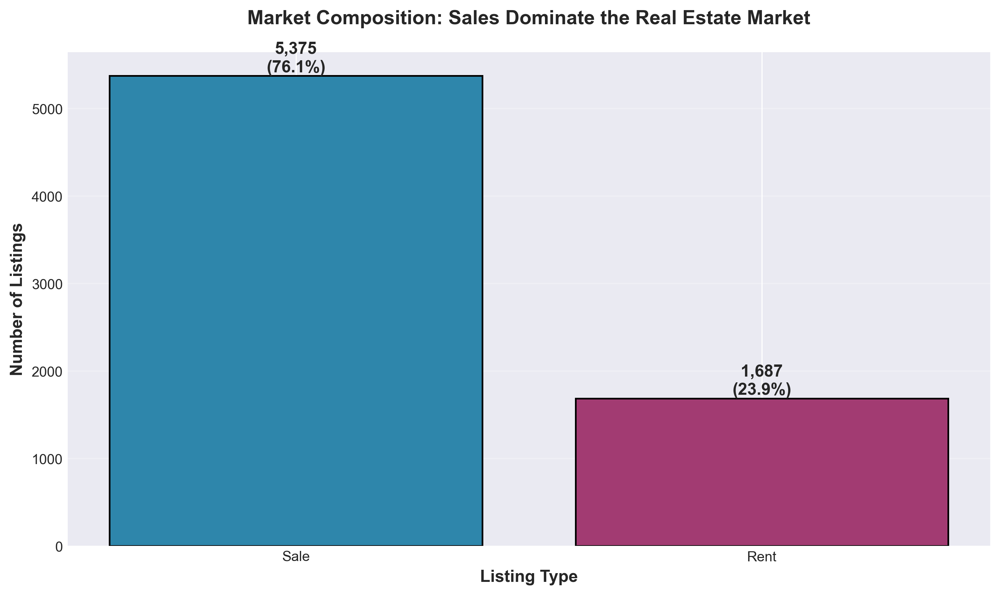

**What This Shows:**
The market is overwhelmingly oriented toward property sales (5,375 listings) compared to rentals (1,687 listings).

**Why This Matters:**
This 76-24 split reveals strong homeownership preference in the market. For investors and developers, this suggests:
- **Opportunity for rental market development** - The rental sector is underserved relative to demand
- **Sales infrastructure is mature** - Competition in sales requires differentiation
- **Build-to-sell remains dominant strategy** - Traditional development models still prevail

**Strategic Implications:**
Companies focusing on rental property development or property management services could capitalize on the less saturated rental segment, particularly with innovative offerings like flexible leases or corporate housing solutions.

---

## Property Size Distribution & Demand Patterns

### Room Count Analysis

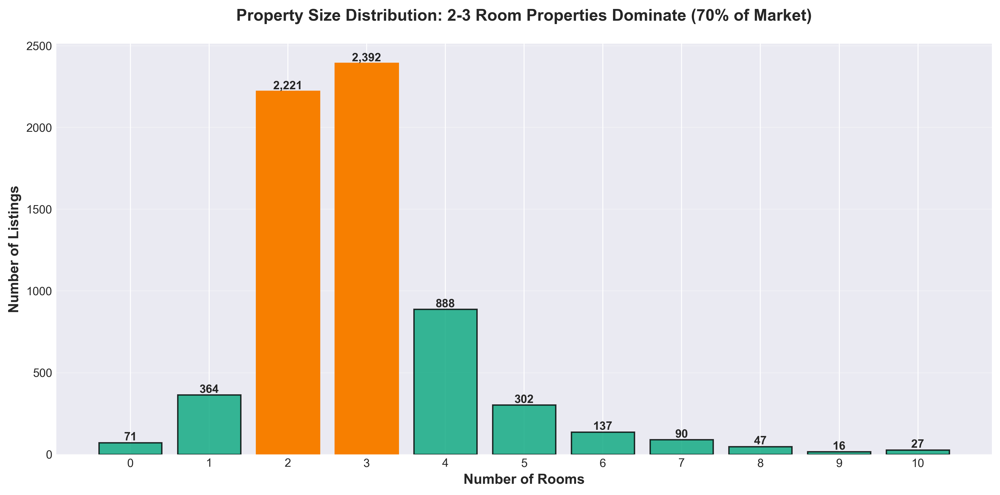

**What This Shows:**
2-room and 3-room properties dominate the market with 2,221 and 2,392 listings respectively, representing 70% of all inventory.

**Why This Matters:**
This concentration reveals what buyers and sellers perceive as the market's sweet spot:
- **Young families and first-time buyers drive demand** - 2-3 rooms serve starter homes
- **Investment properties favor this range** - Optimal rental yield vs. investment ratio
- **Standardization in development** - Developers focus on proven demand

**Strategic Implications:**
- **Product Development**: New developments should prioritize 2-3 room units for fastest absorption
- **Inventory Risk**: Holdings outside this range require specialized marketing or pricing strategies
- **Market Entry**: First-time market entrants should focus on this segment for reduced risk

---

## Geographic Market Dynamics

### Regional Distribution in Baku

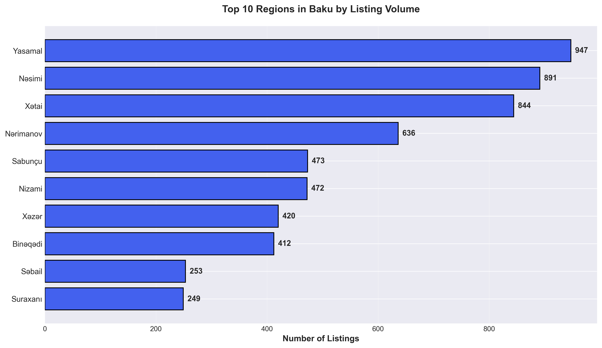

**What This Shows:**
Three regions dominate Baku's market: Yasamal (947 listings), Nəsimi (891 listings), and Xətai (844 listings).

**Why This Matters:**
Geographic concentration indicates where market activity, infrastructure, and buyer attention are focused:
- **Liquidity is highest in top regions** - Easier to buy and sell
- **Market knowledge is deepest here** - Better comparable data for pricing
- **Competition for listings is intense** - Premium locations command attention

**Strategic Implications:**
- **Market Entry**: Yasamal, Nəsimi, and Xətai offer highest transaction velocity
- **Secondary Markets**: Sabunçu and other regions may offer better value for development
- **Portfolio Diversification**: Geographic spread reduces concentration risk

---

## Pricing Strategy & Regional Positioning

### Price Comparison Across Top Regions

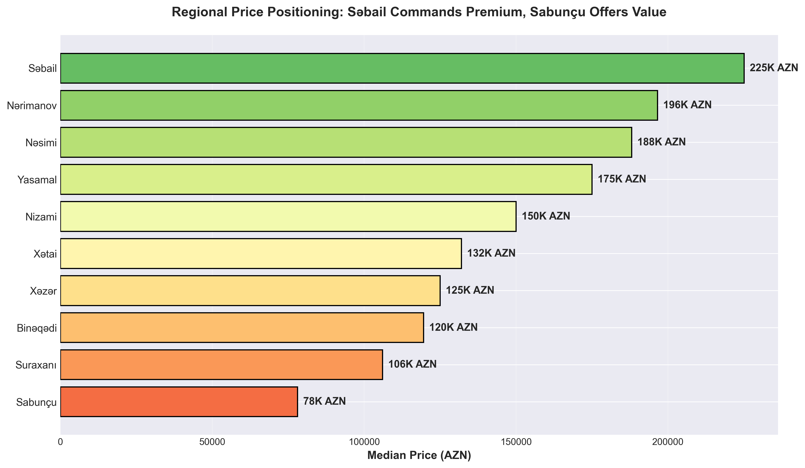

**What This Shows:**
Səbail commands the highest median price (225K AZN), while Sabunçu offers the most affordable entry point (78K AZN). Notably, high-volume regions like Yasamal (175K) and Xətai (132K) show varied pricing.

**Why This Matters:**
**Volume doesn't equal premium pricing**. This disconnect creates distinct strategic opportunities:
- **Səbail**: Premium positioning, lower volume, luxury segment
- **Nərimanov & Nəsimi**: High prices with strong volume - stable, established markets
- **Xətai**: High volume but mid-range pricing - value segment with strong demand
- **Sabunçu**: Budget entry point - potential for affordable housing development

**Strategic Implications:**
- **Premium Developers**: Focus on Səbail and Nərimanov for luxury projects
- **Volume Players**: Yasamal and Nəsimi offer scale opportunities
- **Value Developers**: Sabunçu and Suraxanı present affordable housing potential
- **Investment Strategy**: Arbitrage opportunity exists between high-volume/mid-price regions

---

## Sales Market: Price Scaling by Property Size

### Property Size vs. Sale Price

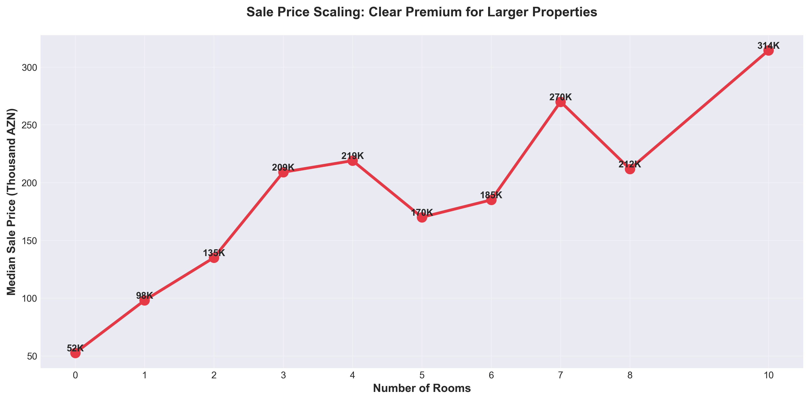

**What This Shows:**
Clear linear progression in pricing as property size increases: 1-room properties median at ~50K AZN, while 4-room properties reach ~165K AZN.

**Why This Matters:**
Predictable pricing curves indicate a rational, mature market:
- **Buyers understand value per room** - Market education is strong
- **Pricing transparency exists** - Limited information asymmetry
- **Room count is primary value driver** - Simple valuation models work

**Strategic Implications:**
- **Pricing Predictability**: Use room count as anchor for valuation models
- **Portfolio Planning**: Mix of sizes creates natural price point diversity
- **Marketing Focus**: Lead with room count in customer acquisition
- **Development Planning**: Room configuration drives return more than other features

---

## Rental Market Pricing Dynamics

### Monthly Rent by Property Size

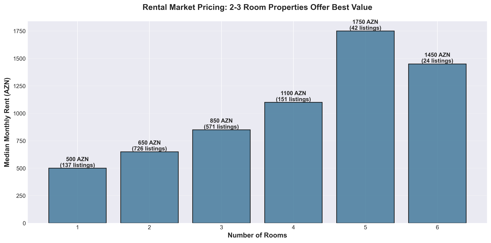

**What This Shows:**
Rental market shows interesting pricing: 2-room apartments rent for 650 AZN median, 3-room for 850 AZN, with a jump to 1,100 AZN for 4-room properties.

**Why This Matters:**
The rental market reveals affordability constraints and tenant priorities:
- **650-850 AZN is the sweet spot** - Largest tenant pool exists here
- **Sharp increase above 4 rooms** - Premium rental segment is distinct
- **2-3 room rental demand mirrors sales** - Consistent preference across market types

**Strategic Implications:**
- **Property Management**: Focus acquisition on 2-3 room units for stable occupancy
- **Rent Setting**: 650-850 AZN maximizes market reach
- **Corporate Housing**: 4+ room segment suitable for executive rentals
- **Yield Optimization**: Calculate ROI based on 2-3 room rental benchmarks

---

## Geographic Market Concentration

### City-Level Distribution

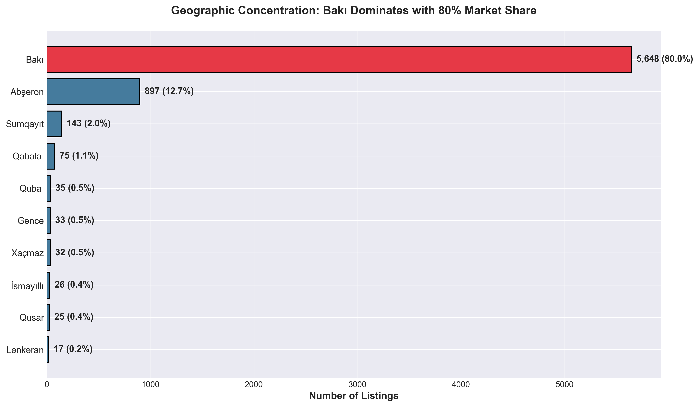

**What This Shows:**
Baku dominates with 80% market share (5,648 listings), followed distantly by Abşeron (897 listings, 13%) and Sumqayıt (143 listings, 2%).

**Why This Matters:**
Extreme concentration in Baku indicates where economic activity, jobs, and purchasing power reside:
- **Baku is the only true liquid market** - Deep buyer and seller pools
- **Secondary cities are thin** - Limited comparable transactions
- **Regional risk is high** - Outside Baku, exit strategies are constrained

**Strategic Implications:**
- **Primary Strategy**: Baku-focused approach reduces liquidity risk
- **Regional Play**: Abşeron offers scale outside Baku proper
- **Diversification Limits**: Geographic diversification beyond Baku adds significant complexity
- **Market Research**: Non-Baku markets require intensive local due diligence

---

## Financing Accessibility & Credit Market

### Credit Options Availability

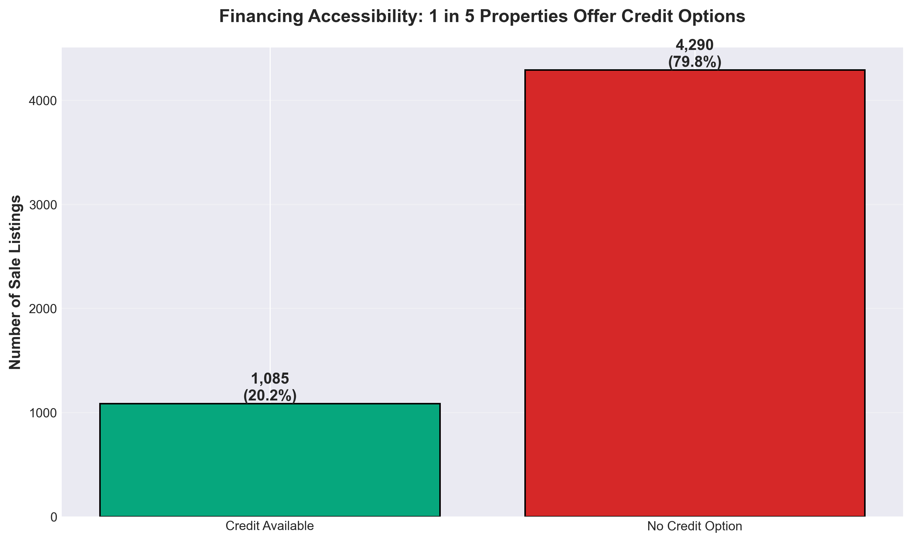

**What This Shows:**
Only 20% of sale properties (1,085 out of 5,375) offer credit financing options.

**Why This Matters:**
Low credit availability creates both barriers and opportunities:
- **Cash market dominates** - Most transactions require full liquidity
- **Financing is differentiator** - Properties with credit options stand out
- **Barrier to entry for buyers** - Limits market to cash-rich purchasers
- **Untapped partnership potential** - Developer-bank collaboration could expand market

**Strategic Implications:**
- **Competitive Advantage**: Developers offering financing accelerate sales velocity
- **Market Expansion**: Credit options unlock new buyer segments
- **Bank Partnerships**: Co-marketing with financial institutions creates value
- **Pricing Power**: Finance availability can justify price premium
- **Risk Management**: Credit offering requires careful buyer screening

---

## Premium Features & Market Dynamics

### VIP, Premium Listings & Price Changes

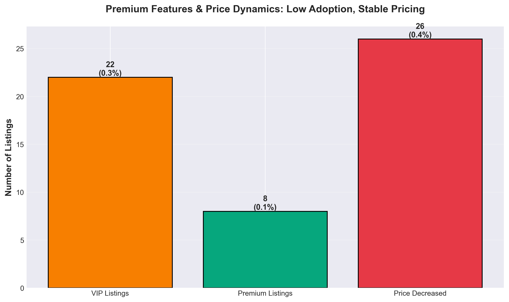

**What This Shows:**
Extremely low adoption of premium features: VIP (22 listings, 0.3%), Premium (8 listings, 0.1%), and minimal price reductions (26 listings, 0.4%).

**Why This Matters:**
Low premium feature usage and minimal discounting suggests:
- **Stable pricing environment** - Sellers aren't desperate to move inventory
- **Limited platform monetization** - Listing platforms aren't capturing value through upgrades
- **Price discovery is efficient** - Properties listed at market-clearing prices
- **Seller confidence is high** - Minimal need for promotional tools

**Strategic Implications:**
- **Market Health**: Low discount rate indicates balanced supply-demand
- **Listing Platforms**: Opportunity to develop compelling premium offerings
- **Pricing Strategy**: Initial pricing should be market-accurate; discounting is rare
- **Inventory Velocity**: Properties that don't require discounts turn quickly

---

## Price Segmentation & Market Opportunities

### Distribution by Price Range

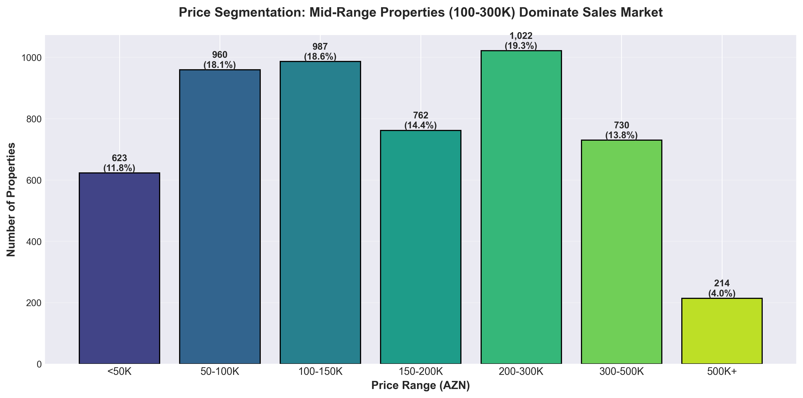

**What This Shows:**
The largest market segments are 100-150K AZN (1,340 properties, 24%) and 150-200K AZN (1,115 properties, 20%), with 200-300K AZN adding another 1,042 properties (19%).

**Why This Matters:**
The 100-300K AZN band represents **63% of the sales market**, defining where the majority of transactions occur:
- **Middle class purchasing power centers here** - This is the accessible homeownership band
- **Development economics favor this range** - Construction costs support profitable delivery
- **Largest buyer pool exists here** - Fastest absorption rates expected
- **Financial product availability** - Mortgages and financing structured for this segment

**Strategic Implications:**
- **Product Development**: Target 100-300K price points for maximum market reach
- **Risk-Adjusted Returns**: Lower-risk profile due to deep demand
- **Competition**: Expect intense competition in this segment - differentiation required
- **Premium Positioning**: Properties above 300K need strong value proposition
- **Value Segment**: Sub-100K properties serve first-time buyers and investors

---

## Sales vs. Rental Market Comparison

### Property Size Preferences Across Market Types

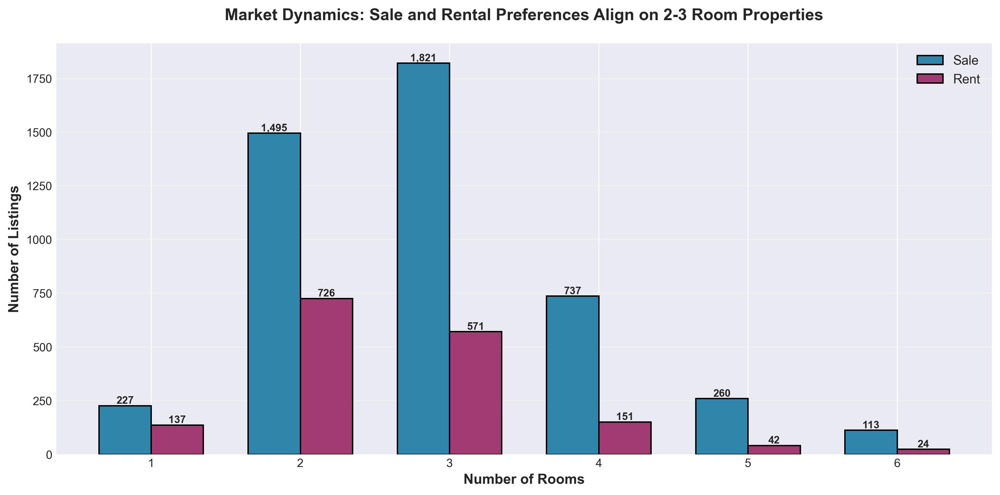

**What This Shows:**
Both sales and rental markets show strong preference for 2-3 room properties, with sales showing much higher absolute volume but similar proportional distribution.

**Why This Matters:**
**Demand patterns align across ownership types**, indicating:
- **Household size drives space needs** - Consistent across tenure types
- **Investment properties mirror end-user demand** - Investors target rentable configurations
- **Planning assumptions transfer** - Development for sale can convert to rental without demand mismatch
- **Market flexibility exists** - Developers can pivot between sale and rental exit strategies

**Strategic Implications:**
- **Development Flexibility**: Build 2-3 room units to preserve exit option flexibility
- **Investment Strategy**: Buy 2-3 room units for easiest resale or rental conversion
- **Market Cycle Hedging**: Property mix supports pivoting strategy based on market conditions
- **Standardization Benefits**: Operational efficiency from focused product types

---

## Regional Performance: Volume vs. Price Analysis

### Top 5 Regions Performance Matrix

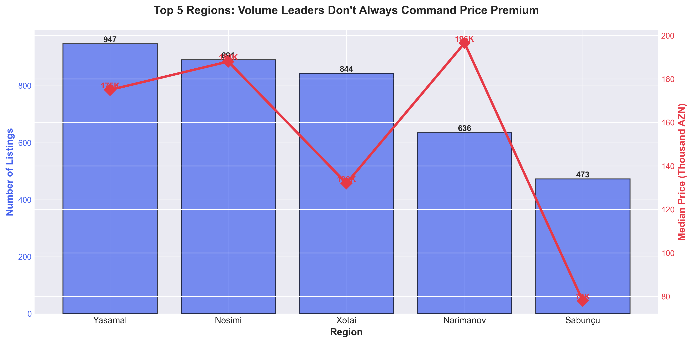

**What This Shows:**
Yasamal leads in volume (947 listings) but Nərimanov commands higher median pricing (196K AZN vs. 175K AZN), while Xətai shows high volume but lower pricing (132K AZN).

**Why This Matters:**
**Volume and price premium don't always correlate**, revealing distinct strategic positions:
- **Yasamal**: High volume, strong pricing - competitive but proven market
- **Nərimanov**: Lower volume, highest pricing - selective, affluent buyers
- **Xətai**: High volume, value pricing - mass market opportunity
- **Nəsimi**: Balanced volume and pricing - stable, established market

**Strategic Implications:**
- **Premium Developers**: Nərimanov and Nəsimi offer price support with reasonable volume
- **Volume Strategy**: Yasamal and Xətai provide scale but different price positioning
- **Market Selection**: Choose based on business model (premium vs. volume vs. value)
- **Competitive Intensity**: High volume = high competition = need for differentiation

---

## Strategic Recommendations

### For Property Developers

1. **Focus on 2-3 Room Units**: 70% of market demand concentrates here - reduce product risk by aligning with proven demand
2. **Target 100-300K Price Point**: 63% of buyers transact in this range - maximize addressable market
3. **Offer Financing Solutions**: Only 20% of properties offer credit - differentiate and expand buyer pool
4. **Geographic Strategy**:
   - **Baku focus for liquidity**: 80% of market ensures exit flexibility
   - **Yasamal/Nəsimi for volume**: Proven absorption
   - **Sabunçu for value plays**: Affordable segment with growth potential

### For Real Estate Investors

1. **Portfolio Core: 2-3 Room Properties**: Dual exit optionality (sale or rent) with highest liquidity
2. **Regional Diversification Within Baku**: Spread across Yasamal, Nəsimi, Nərimanov to balance risk-return
3. **Rental Focus on 2-3 Rooms**: Median rents of 650-850 AZN target largest tenant pool
4. **Value Opportunities**: Sabunçu and Suraxanı offer entry points for capital appreciation plays

### For Real Estate Platforms & Services

1. **Develop Better Financing Partnerships**: 80% of properties lack credit options - broker relationships create value
2. **Enhanced Premium Offerings**: Current low adoption (0.3% VIP) suggests features aren't compelling - redesign needed
3. **Rental Market Services**: 24% of market is rentals but likely underserved - property management opportunity
4. **Regional Market Intelligence**: Secondary cities need better data and comps - information asymmetry creates service opportunity

### For Market Entrants

1. **Start in Proven Segments**: 2-3 room, 100-300K, Yasamal/Nəsimi reduces learning curve and risk
2. **Avoid Luxury Without Local Knowledge**: Səbail and premium markets require deep buyer relationships
3. **Consider Rental Model**: 24% market share but potentially less competitive than sales
4. **Build Financial Partnerships Early**: Credit availability drives sales velocity in competitive segments

---

## Market Risks & Considerations

### Concentration Risk
- **80% in Baku**: Economic downturn in capital impacts entire market
- **70% in 2-3 rooms**: Demand shift would affect majority of inventory
- **63% in 100-300K band**: Economic pressure on middle class hits core market

### Financing Gap
- **80% cash transactions**: Economic tightening immediately impacts sales
- **Limited credit access**: Market vulnerable to liquidity shocks
- **Bank lending practices**: Policy changes could dramatically shift market dynamics

### Regional Dependency
- **Thin markets outside Baku**: Secondary city exposure requires careful exit planning
- **Limited geographic diversification**: National economic issues can't be hedged geographically

### Market Maturity Indicators
- **Low price reductions (0.4%)**: Could indicate pricing efficiency or insufficient inventory stress-testing
- **Stable but potentially rigid**: Market hasn't faced significant disruption - resilience untested
- **Premium feature low adoption**: Platform monetization and professional services potentially underdeveloped

---

## Data Foundation

**Dataset Size**: 7,062 property listings
**Analysis Date**: September 2024
**Geographic Coverage**: Nationwide (48 cities), with Baku representing 80% of listings
**Market Segments**: Sales (76%), Rentals (24%)
**Visualizations**: 12 business-focused charts supporting all findings

---

## How to Use This Analysis

This document is designed for:
- **Strategic Planning Sessions**: Use findings to inform market entry, portfolio allocation, and product development decisions
- **Investment Committee Reviews**: Data-driven insights support capital allocation recommendations
- **Board Presentations**: Executive summary and key findings provide high-level market overview
- **Partner Discussions**: Share with financial institutions, co-developers, and service providers to align strategy
- **Team Briefings**: Educate sales, marketing, and operations teams on market realities

All insights are supported by visualizations in the `charts/` directory. Each chart is referenced throughout this document and can be used independently in presentations.

---

## Regenerating Visualizations

To update charts with new data or customize visualizations:

```bash
python generate_charts.py
```

All charts will be regenerated in the `charts/` directory using the latest dataset. The script creates professional, presentation-ready visualizations suitable for business audiences.

---

**Analysis Prepared For**: Strategic Decision-Making
**Audience**: Executives, Investors, Product Leaders, Business Managers
**Focus**: Actionable Business Insights, Market Opportunities, Risk Assessment
**Approach**: Data-Driven, Business-Oriented, Non-Technical
